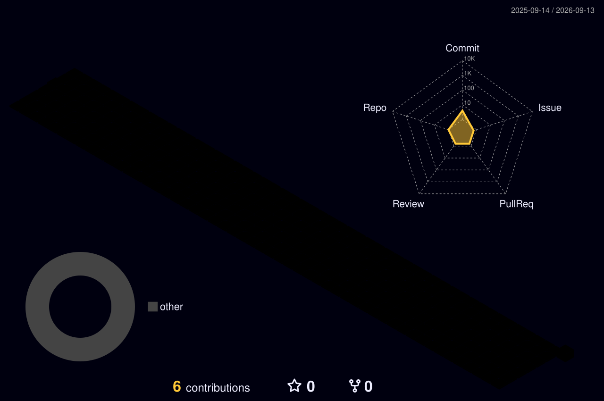

<!-- ═══════════════════════════ HEADER ═══════════════════════════ -->

  

<!-- ═══════════════════════════ TYPING ═══════════════════════════ -->

  

<!-- ═══════════════════════════ SOCIAL ═══════════════════════════ -->

  &nbsp;
  &nbsp;
  

  

 

<!-- ═══════════════════════════ ABOUT ═══════════════════════════ -->

## 🧑‍💻 About Me

- 🚀 I build **custom web applications** with **Laravel & PHP**
- 🗄️ I design clean, scalable **MySQL** database schemas
- 🔌 I develop & integrate **RESTful APIs** for web and mobile
- 📍 Based in **Bangladesh** 🇧🇩
- 💼 **Open to freelance & full-time opportunities**
- 📫 Reach me: **jzjoy95@gmail.com** · [mrzihad.com](https://mrzihad.com/)
- ⚡ Fun fact: I love turning ideas into working products

 

<!-- ═══════════════════════════ TECH STACK ═══════════════════════════ -->
## 🛠️ Tech Stack

  

 

<!-- ═══════════════════════════ STATS ═══════════════════════════ -->
## 📊 GitHub Stats

  

  
  

 

<!-- ═══════════════════════════ 3D CONTRIBUTION ═══════════════════════════ -->
## 🧊 3D Contribution Graph

  

 

<!-- ═══════════════════════════ SNAKE ═══════════════════════════ -->
## 🐍 Contribution Snake

  <picture>
    <source media="(prefers-color-scheme: dark)" srcset="https://raw.githubusercontent.com/jzjoy/jzjoy/output/github-snake-dark.svg">
    <source media="(prefers-color-scheme: light)" srcset="https://raw.githubusercontent.com/jzjoy/jzjoy/output/github-snake.svg">
    
  </picture>

<!-- ═══════════════════════════ FOOTER ═══════════════════════════ -->

  

